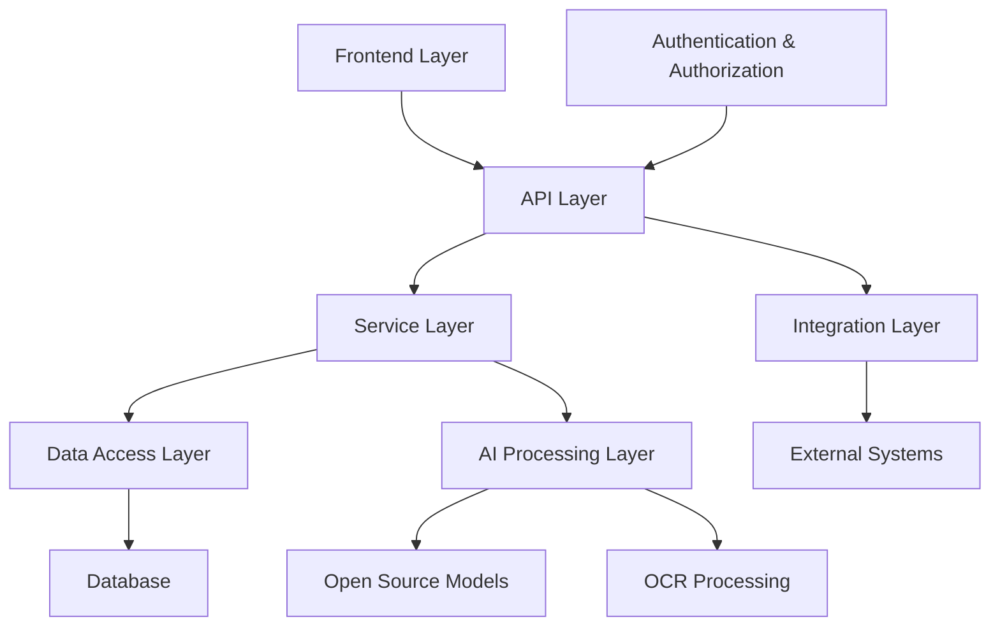
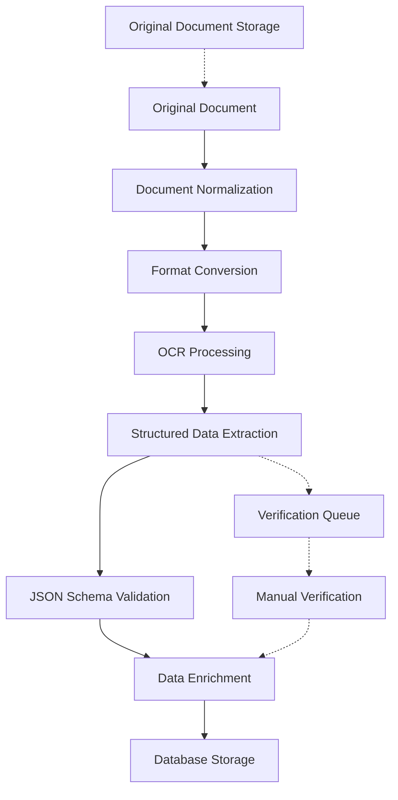

# AI Employee Decision System: Technical Design Document

## Document Information
- **Version**: 1.0
- **Last Updated**: July 18, 2025
- **Status**: Draft
- **Related Documents**: 
  - [Requirements Document](./requirements.md)
  - [Implementation Tasks](./tasks.md)

## Table of Contents
1. [Overview](#overview)
2. [Architecture](#architecture)
3. [Structured Data Processing](#structured-data-processing)
4. [Components and Interfaces](#components-and-interfaces)
5. [Data Models](#data-models)
6. [Error Handling](#error-handling)
7. [Testing Strategy](#testing-strategy)
8. [Security Design](#security-design)
9. [Internationalization and Localization](#internationalization-and-localization)
10. [Deployment and DevOps](#deployment-and-devops)
11. [Open Source and Licensing](#open-source-and-licensing)

## Overview

### Purpose and Scope
The AI Employee Decision System is designed to assist office managers and HR staff in academic environments (particularly universities) in making data-driven organizational decisions about employees. The system leverages open-source AI models to analyze employee data and CVs, providing recommendations for various organizational decisions while ensuring compliance with GDPR and APPI regulations.

### Design Philosophy
This system follows a "local-first" design philosophy, prioritizing:
- Privacy through local processing of sensitive data
- Offline capability for core functionality
- Natural language as the primary interface
- Cross-platform availability as standalone applications
- Extensibility through modular architecture

### Target Platforms
- Windows 10/11 (64-bit)
- macOS 11+ (Intel and Apple Silicon)
- Linux (Ubuntu 20.04+, Debian 11+)

### Key Design Decisions
- Python-based core for cross-platform compatibility
- Hybrid OCR approach combining Tesseract and Mistral AI
- Structured data exchange using versioned JSON schemas
- Tiered document processing pipeline
- Natural language interface as primary interaction method

### Technology Stack Comparison

| Aspect |  Previous Node.js Approach | Current Python-Based Approach |
|--------|----------------------------|-------------------------------|
| **Distribution** | Web application requiring server deployment | Standalone executables for all platforms |
| **Interface** | Traditional web UI with separate API | Natural language as primary interface |
| **Offline Capability** | Limited, requires server connection | Full offline functionality with local LLM |
| **AI Integration** | API calls to external AI services | Embedded, optimized LLMs running locally |
| **Deployment** | Server-focused, requires infrastructure | End-user focused, minimal setup |
| **Multi-language** | Frontend translations only | Deep language integration in LLM and OCR |
| **Performance** | Fast UI rendering, slower AI processing | Optimized for AI workloads and inference |
| **Privacy** | Data sent to external services | Data processed locally for enhanced privacy |
| **Licensing** | Open-source web app | Commercial distribution with licensing |
| **Target Market** | Web-savvy organizations | All organizations, including those with privacy concerns |

## Architecture

The system follows a modern, modular architecture with clear separation of concerns to ensure maintainability, scalability, and extensibility. The architecture consists of the following layers:

### High-Level Architecture



### Key Architectural Decisions

1. **Microservices Approach**: The system is designed as a set of loosely coupled services that can be developed, deployed, and scaled independently.

2. **API-First Design**: All functionality is exposed through well-defined APIs to facilitate integration with external systems.

3. **Layered Architecture**: Clear separation between presentation, business logic, data access, and AI processing layers.

4. **Offline-Capable AI**: AI models are designed to run locally when possible, enhancing privacy and reducing dependency on external services.

5. **Multi-Language Support**: The architecture includes internationalization at all levels, with initial focus on German and Japanese.

6. **Modular Design**: Core functionality is packaged as a base module, with domain-specific extensions for academic environments.

## Components and Interfaces

### 1. Frontend Component

**Purpose**: Provides a natural language-first interface as a distributable package with an optimally sized fine-tuned LLM for local execution across platforms.

**Key Features**:
- Natural language interface as the primary interaction method
- Distributable executable packages for Windows, macOS, and Linux
- Offline-capable with locally-hosted fine-tuned proprietary LLM
- Multi-language support (German and Japanese priority)
- Conversational UI for all system interactions
- Minimal, intuitive dashboard for non-technical users
- Licensing system for commercial distribution
- Responsive design that works across devices

**Technologies**:
- Python-based application core (for cross-platform compatibility)
- PyInstaller/cx_Freeze for creating standalone executables
- Gradio/Streamlit for rapid UI development with minimal JavaScript
- ONNX Runtime for optimized model inference
- SQLite for local data storage with PostgreSQL for server deployments
- Python i18n libraries for internationalization

### 2. API Layer

**Purpose**: Provides a unified interface for both local and remote interactions with the system through natural language.

**Key Features**:
- Natural language command processing as primary API
- Authentication and authorization with offline capabilities
- Employee data CRUD operations through conversational interface
- CV upload and processing with local OCR capabilities
- AI query processing with response explanation
- Reporting and analytics through natural language queries
- Integration endpoints for external systems
- Local-first architecture with cloud synchronization options

**Technologies**:
- FastAPI for high-performance Python API
- Local API server for offline operation
- JWT for authentication with local token storage
- OpenAPI/Swagger for documentation
- Rate limiting and security middleware
- WebSocket support for real-time conversational interface

### 3. Service Layer

**Purpose**: Implements business logic and orchestrates operations across components.

**Key Modules**:
- EmployeeService: Manages employee data operations
- CVProcessingService: Handles CV analysis and extraction
- AIDecisionService: Processes natural language queries and generates recommendations
- ReportingService: Generates reports and analytics
- IntegrationService: Manages data exchange with external systems

**Design Patterns**:
- Repository pattern for data access
- Strategy pattern for different AI processing approaches
- Observer pattern for event-driven updates
- Factory pattern for creating service instances

### 4. Data Access Layer

**Purpose**: Provides abstraction for database operations.

**Key Features**:
- ORM mappings for database entities
- Transaction management
- Query optimization
- Data validation
- Audit logging

**Technologies**:
- SQLAlchemy for ORM
- Alembic for database migrations
- Connection pooling for performance

### 5. AI Processing Layer

**Purpose**: Manages AI model loading, inference, and results processing with a focus on distributable, optimized LLMs.

**Key Components**:
- ModelManager: Loads and manages fine-tuned AI models with version control
- OCRProcessor: Handles document text extraction with multi-language support
- NLPProcessor: Processes natural language queries in German and Japanese
- RecommendationEngine: Generates and ranks recommendations based on employee data
- ExplanationGenerator: Creates human-readable explanations for AI decisions
- ModelDistributor: Packages and distributes optimized models for different platforms
- DocumentProcessor: Manages document conversion, normalization, and structured data extraction

**Technologies**:
- Hybrid OCR approach:
  - Tesseract for initial character recognition and layout analysis
  - Mistral AI for semantic understanding and contextual extraction
- Quantized open-source LLMs for efficient local deployment
- ONNX Runtime for cross-platform model inference
- Model compression techniques (pruning, quantization, distillation)
- Local model serving with minimal resource requirements
- Fine-tuning pipeline for domain adaptation (academic/university context)

**OCR Technology Comparison**:

| Feature | Tesseract | Mistral AI | Hybrid Approach |
|---------|-----------|------------|-----------------|
| Character Recognition | High accuracy for clear text | Moderate for basic OCR | Uses Tesseract strengths |
| Layout Understanding | Limited | Strong | Combines both |
| Language Support | Good for Latin scripts | Excellent for multiple scripts | Best coverage |
| Context Understanding | None | Strong | Leverages Mistral's capabilities |
| Processing Speed | Fast | Slower | Optimized pipeline |
| Resource Usage | Low | High | Tiered processing |
| Accuracy on Academic Documents | Moderate | High | Highest |

The hybrid approach leverages Tesseract's efficiency for initial text recognition while using Mistral AI's semantic understanding to extract meaning and context from the recognized text.

### 6. Integration Layer

**Purpose**: Facilitates data exchange with external systems.

**Key Features**:
- Webhook support for event-driven integration
- Data transformation and mapping
- Synchronization management
- Error handling and retry logic

**Technologies**:
- RESTful API clients
- Message queues for asynchronous processing
- OAuth for secure authentication with external systems

## Structured Data Processing

### Data Exchange Format

To ensure consistency, maintainability, and efficiency throughout the system, we will implement standardized structured data formats for all internal data exchange and processing:

#### JSON Schema Standardization

All internal data exchange between components will use JSON with strictly defined schemas:

1. **Schema Registry**:
   - Centralized repository of all JSON schemas used in the system
   - Version control for schema evolution
   - Automatic validation of data against schemas

2. **Core Schema Types**:
   - `EmployeeSchema`: For employee profile data
   - `DocumentSchema`: For document metadata and extracted content
   - `SkillSchema`: For skill definitions and taxonomies
   - `QuerySchema`: For AI queries and responses
   - `RecommendationSchema`: For AI recommendations with confidence scores

3. **Schema Versioning**:
   - Semantic versioning (MAJOR.MINOR.PATCH)
   - Backward compatibility guarantees
   - Migration utilities for schema evolution

#### Document Processing Pipeline



1. **Document Normalization**:
   - Convert all incoming documents to standard formats
   - PDF for text documents
   - PNG/TIFF for images
   - Standardize resolution and quality

2. **Format Conversion Pipeline**:
   - Original document preserved unchanged
   - Working copy converted to processable format
   - Metadata extraction (creation date, author, etc.)
   - Document structure analysis (pages, sections)

3. **OCR and Data Extraction**:
   - Tiered processing approach:
     - Level 1: Basic OCR with Tesseract (fast, efficient)
     - Level 2: Enhanced understanding with Mistral AI (context-aware)
     - Level 3: Human verification for low-confidence extractions
   - Structured output in standardized JSON format
   - Confidence scoring for each extracted field

4. **Data Transformation and Storage**:
   - Mapping extracted data to database schema
   - Validation against JSON schemas
   - Versioned storage of processed documents
   - Linkage to original documents

#### Benefits of Structured Approach

1. **Maintainability**:
   - Clear data contracts between components
   - Reduced coupling between services
   - Self-documenting data structures

2. **Efficiency**:
   - Optimized processing based on document type
   - Caching of intermediate results
   - Parallel processing where possible

3. **Quality Assurance**:
   - Validation at each processing stage
   - Clear audit trail of transformations
   - Confidence scoring for extracted data

4. **Extensibility**:
   - New document types can be added with minimal changes
   - New extraction algorithms can be plugged in
   - Schema evolution without breaking changes

## Data Models

### Core Entities

#### Employee

```
Employee {
  id: UUID (PK)
  first_name: String
  last_name: String
  email: String
  position: String
  department: String
  hire_date: Date
  background: Text
  skills: Array<Skill>
  specializations: Array<Specialization>
  custom_tags: Array<Tag>
  cv_documents: Array<Document>
  created_at: DateTime
  updated_at: DateTime
  created_by: UUID (FK to User)
  updated_by: UUID (FK to User)
}
```

#### Skill

```
Skill {
  id: UUID (PK)
  name: String
  category: String
  level: Integer (1-5)
  verified: Boolean
  source: String (manual/cv)
  employee_id: UUID (FK to Employee)
  created_at: DateTime
  updated_at: DateTime
}
```

#### Document

```
Document {
  id: UUID (PK)
  name: String
  type: String (CV, certificate, etc.)
  file_path: String
  mime_type: String
  size: Integer
  upload_date: DateTime
  
  // Document processing fields
  original_file_path: String
  normalized_file_path: String
  processing_status: String (pending, processing, completed, failed, verified)
  processing_level: Integer (1-3, indicating processing depth)
  
  // Extraction metadata
  extracted_data: JSON (schema-validated structured data)
  extraction_confidence: Float (0-1)
  extraction_version: String (schema version used)
  
  // Verification
  verified: Boolean
  verification_date: DateTime
  verified_by: UUID (FK to User)
  
  // Relationships
  employee_id: UUID (FK to Employee)
  created_at: DateTime
  updated_at: DateTime
  created_by: UUID (FK to User)
}
```

#### Project

```
Project {
  id: UUID (PK)
  name: String
  description: Text
  start_date: Date
  end_date: Date
  status: String
  required_skills: Array<Skill>
  team_members: Array<Employee>
  created_at: DateTime
  updated_at: DateTime
  created_by: UUID (FK to User)
  updated_by: UUID (FK to User)
}
```

#### AIQuery

```
AIQuery {
  id: UUID (PK)
  query_text: Text
  query_language: String
  query_type: String
  parameters: JSON
  result: JSON
  confidence_score: Float
  execution_time: Integer
  user_id: UUID (FK to User)
  created_at: DateTime
}
```

#### User

```
User {
  id: UUID (PK)
  username: String
  email: String
  password_hash: String
  first_name: String
  last_name: String
  role: String
  department: String
  is_active: Boolean
  last_login: DateTime
  created_at: DateTime
  updated_at: DateTime
}
```

### Database Schema

The database schema will use PostgreSQL with the following design considerations:

1. **Indexes**:
   - Primary keys on all ID fields
   - Indexes on frequently queried fields (email, name, skills)
   - Full-text search indexes for text fields

2. **Relationships**:
   - One-to-many between Employee and Skill
   - One-to-many between Employee and Document
   - Many-to-many between Project and Employee
   - One-to-many between User and AIQuery

3. **Constraints**:
   - Unique constraints on email addresses
   - Foreign key constraints with cascading updates
   - Check constraints for data validation

4. **Partitioning**:
   - Time-based partitioning for log tables
   - Consideration for partitioning large tables by organization

## Error Handling

The system implements a comprehensive error handling strategy:

### Error Categories

1. **Validation Errors**: Invalid input data
   - HTTP Status: 400 Bad Request
   - Handled at API layer with detailed error messages

2. **Authentication Errors**: Invalid credentials or tokens
   - HTTP Status: 401 Unauthorized
   - Handled by authentication middleware

3. **Authorization Errors**: Insufficient permissions
   - HTTP Status: 403 Forbidden
   - Handled by authorization middleware

4. **Resource Errors**: Requested resource not found
   - HTTP Status: 404 Not Found
   - Handled at service layer

5. **Business Logic Errors**: Violations of business rules
   - HTTP Status: 422 Unprocessable Entity
   - Handled at service layer with specific error codes

6. **Integration Errors**: Issues with external systems
   - Logged and retried with exponential backoff
   - Fallback mechanisms implemented

7. **System Errors**: Unexpected internal errors
   - HTTP Status: 500 Internal Server Error
   - Logged with stack traces and context
   - Alerts sent to administrators

### Error Response Format

```json
{
  "error": {
    "code": "ERROR_CODE",
    "message": "User-friendly error message",
    "details": [
      {
        "field": "affected_field",
        "message": "Specific error for this field"
      }
    ],
    "request_id": "unique-request-identifier"
  }
}
```

### Logging Strategy

- Structured logging with JSON format
- Log levels (DEBUG, INFO, WARNING, ERROR, CRITICAL)
- Context enrichment (user, request ID, etc.)
- Sensitive data masking
- Rotation and retention policies
- Centralized log collection

## Testing Strategy

The system employs a comprehensive testing approach:

### Test Types

1. **Unit Tests**:
   - Test individual components in isolation
   - Mock external dependencies
   - Coverage target: 80%+

2. **Integration Tests**:
   - Test interactions between components
   - Use test databases
   - Focus on API contracts and data flow

3. **End-to-End Tests**:
   - Test complete user workflows
   - Simulate real user interactions
   - Cover critical business processes

4. **Performance Tests**:
   - Load testing for concurrent users
   - Response time benchmarks
   - Resource utilization monitoring

5. **Security Tests**:
   - Vulnerability scanning
   - Authentication and authorization testing
   - Input validation and sanitization

6. **Internationalization Tests**:
   - Verify multi-language support
   - Test character encoding
   - Validate localized content

7. **AI Model Tests**:
   - Test model accuracy and performance
   - Evaluate recommendation quality
   - Verify explanation generation

### Testing Tools

- PyTest for Python unit and integration tests
- Jest for JavaScript/TypeScript tests
- Selenium for end-to-end tests
- Locust for performance testing
- OWASP ZAP for security testing

### CI/CD Integration

- Automated test execution on commits
- Test environments for different stages
- Quality gates based on test results
- Deployment only after passing all tests

## Security Design

### Authentication and Authorization

1. **Authentication Methods**:
   - JWT-based authentication
   - OAuth 2.0 for third-party integration
   - Multi-factor authentication option

2. **Authorization Model**:
   - Role-based access control (RBAC)
   - Permission-based fine-grained control
   - Resource ownership validation

### Data Protection

1. **Encryption**:
   - TLS for data in transit
   - AES-256 for sensitive data at rest
   - Key management system

2. **Privacy Controls**:
   - Data minimization principles
   - Purpose limitation enforcement
   - Consent management
   - Data subject rights support (access, rectification, erasure)

3. **Compliance Features**:
   - GDPR compliance tools
   - APPI compliance tools
   - Audit trails for all data access
   - Data retention policies

### Secure Development

1. **Secure Coding Practices**:
   - Input validation
   - Output encoding
   - Parameterized queries
   - CSRF protection
   - XSS prevention

2. **Dependency Management**:
   - Regular security updates
   - Vulnerability scanning
   - Software composition analysis

## Internationalization and Localization

### Multi-Language Support

1. **User Interface**:
   - Translatable UI components
   - Right-to-left (RTL) support
   - Language selection persistence

2. **Content**:
   - Externalized string resources
   - Translation management system
   - Context-aware translations

3. **Data Processing**:
   - Unicode support throughout
   - Language-specific text processing
   - Multi-script OCR capabilities

### Localization Strategy

1. **Priority Languages**:
   - German (primary for EU market)
   - Japanese (primary for Asian market)
   - English (fallback)

2. **Localization Aspects**:
   - Date and time formats
   - Number formats
   - Currency handling
   - Address formats
   - Name formats

## Deployment and DevOps

### Deployment Options

1. **Local Deployment**:
   - Standalone executable packages for Windows, macOS, and Linux
   - Installer packages with bundled optimized LLM
   - Offline-first operation with optional cloud synchronization
   - License activation system for commercial distribution

2. **Self-Hosted Server**:
   - Docker containers for server components
   - Simple setup for small organizations
   - Kubernetes orchestration for larger deployments
   - Helm charts for deployment

3. **Cloud Deployment**:
   - Infrastructure as Code (Terraform)
   - Multi-cloud support
   - Auto-scaling configurations
   - Hybrid model with local LLM processing and cloud data storage

### CI/CD Pipeline

1. **Continuous Integration**:
   - Automated builds
   - Static code analysis
   - Unit and integration testing
   - Security scanning

2. **Continuous Deployment**:
   - Environment promotion
   - Blue-green deployments
   - Rollback capabilities
   - Feature flags

### Monitoring and Observability

1. **System Monitoring**:
   - Health checks
   - Resource utilization
   - Performance metrics
   - Alert thresholds

2. **Application Monitoring**:
   - Request tracing
   - Error tracking
   - User activity monitoring
   - Business metrics

## Open Source and Licensing

### Model Selection and Integration

1. **OCR Models**:
   - Tesseract OCR (Apache 2.0)
   - EasyOCR (Apache 2.0)
   - PaddleOCR (Apache 2.0)

2. **Language Models**:
   - Mistral AI (Apache 2.0)
   - Llama 2 (Meta AI license)
   - BERT variants (Apache 2.0)

### Licensing Strategy

1. **Core System**:
   - Proprietary license for commercial wrapper
   - Clear attribution for open-source components
   - License compatibility verification

2. **Documentation**:
   - Comprehensive README
   - Installation guides
   - API documentation
   - Contribution guidelines

3. **Community Engagement**:
   - Issue templates
   - Pull request workflow
   - Community forum
   - Regular release schedule## Design 
Considerations and Trade-offs

### Performance vs. Accuracy

The system balances performance and accuracy through:
- Tiered processing approach that applies more intensive analysis only when needed
- Hybrid OCR approach that combines fast character recognition with deeper semantic understanding
- Confidence scoring to identify when human verification is required
- Caching of intermediate results to avoid redundant processing

### Privacy vs. Functionality

The system prioritizes privacy while maintaining functionality through:
- Local-first processing of sensitive data
- Optimized, quantized models that can run on standard hardware
- Optional cloud synchronization for non-sensitive data
- Clear separation between personal data and analytical data

### Extensibility vs. Simplicity

The system balances extensibility and simplicity through:
- Modular architecture with well-defined interfaces
- Schema-based data exchange with versioning
- Core package with domain-specific extensions
- Configuration over customization for common scenarios

## Implementation Roadmap

The implementation will follow these phases:

1. **Foundation Phase** (Weeks 1-4)
   - Core data models and database
   - Basic document processing
   - Initial UI framework

2. **Intelligence Phase** (Weeks 5-8)
   - AI model integration
   - OCR processing pipeline
   - Natural language interface

3. **Feature Phase** (Weeks 9-12)
   - Employee management features
   - Decision support features
   - Reporting and analytics

4. **Refinement Phase** (Weeks 13-16)
   - Security and compliance
   - Performance optimization
   - Packaging and distribution

## Appendices

### A. Technology Selection Rationale

| Technology | Alternatives Considered | Selection Rationale |
|------------|-------------------------|---------------------|
| Python | Node.js, Java | Cross-platform, strong AI libraries, rapid development |
| SQLite/PostgreSQL | MongoDB, MySQL | Relational model fits employee data, SQLite for local, PostgreSQL for server |
| Mistral AI | GPT-4, BERT | Open-source, efficient, commercial-friendly license |
| Tesseract | ABBYY FineReader, Amazon Textract | Open-source, widely supported, good baseline performance |
| PyInstaller | cx_Freeze, py2exe | Mature, supports all target platforms, good dependency handling |

### B. References

1. Mistral AI Documentation: [https://mistral.ai/docs/](https://mistral.ai/docs/)
2. Tesseract OCR GitHub: [https://github.com/tesseract-ocr/tesseract](https://github.com/tesseract-ocr/tesseract)
3. GDPR Official Text: [https://gdpr-info.eu/](https://gdpr-info.eu/)
4. APPI Guidelines: [https://www.ppc.go.jp/en/](https://www.ppc.go.jp/en/)
5. JSON Schema Specification: [https://json-schema.org/](https://json-schema.org/)

## Document History

| Version | Date | Description | Author |
|---------|------|-------------|--------|
| 0.1 | 2025-07-12 | Initial architecture draft | Design Team |
| 0.2 | 2025-07-16 | Added data models and components | Design Team |
| 1.0 | 2025-07-18 | Finalized design with structured data processing | Design Team |