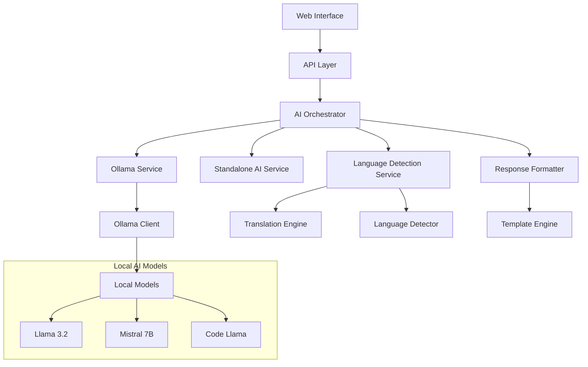

# Design Document

## Overview

This design document outlines the architecture and implementation approach for upgrading the AI Employee Decision System with Ollama integration and multilingual capabilities. The upgrade will enhance the existing system by replacing the standalone AI with a more sophisticated Ollama-based solution while adding support for Japanese and German languages.

The design follows a layered architecture approach with clear separation of concerns, ensuring maintainability, testability, and the ability to fallback to the existing standalone system when needed.

## Architecture

### High-Level Architecture



### Component Architecture

#### 1. AI Orchestrator
The central component that manages AI operations and decides which backend to use.

**Responsibilities:**
- Detect available AI backends (Ollama vs Standalone)
- Route requests to appropriate AI service
- Handle fallback scenarios
- Manage conversation context
- Coordinate multilingual processing

#### 2. Ollama Service
Handles all interactions with Ollama models.

**Responsibilities:**
- Manage Ollama client connections
- Handle model loading and switching
- Process natural language queries
- Generate responses using selected models
- Monitor model performance and health

#### 3. Language Service
Manages multilingual capabilities.

**Responsibilities:**
- Detect input language automatically
- Translate queries when needed
- Format responses according to language conventions
- Handle language-specific templates
- Manage cultural context for responses

#### 4. Enhanced Response Formatter
Formats AI responses with improved capabilities.

**Responsibilities:**
- Apply language-specific formatting
- Generate structured responses
- Handle code formatting and syntax highlighting
- Create multilingual templates
- Format complex data structures

## Components and Interfaces

### AI Orchestrator Interface

```python
class AIOrchestrator:
    def process_query(
        self, 
        query: str, 
        context: Optional[Dict] = None,
        language: Optional[str] = None,
        model_preference: Optional[str] = None
    ) -> AIResponse
    
    def get_available_models(self) -> List[ModelInfo]
    
    def switch_model(self, model_name: str) -> bool
    
    def get_system_status(self) -> SystemStatus
    
    def set_fallback_mode(self, enabled: bool) -> None
```

### Ollama Service Interface

```python
class OllamaService:
    def __init__(self, base_url: str = "http://localhost:11434")
    
    def is_available(self) -> bool
    
    def list_models(self) -> List[str]
    
    def pull_model(self, model_name: str) -> bool
    
    def generate_response(
        self, 
        prompt: str, 
        model: str = "llama3.2",
        system_prompt: Optional[str] = None
    ) -> str
    
    def chat_completion(
        self,
        messages: List[Dict],
        model: str = "llama3.2"
    ) -> str
```

### Language Service Interface

```python
class LanguageService:
    def detect_language(self, text: str) -> str
    
    def translate_query(
        self, 
        query: str, 
        source_lang: str, 
        target_lang: str
    ) -> str
    
    def format_response(
        self, 
        response: str, 
        target_language: str
    ) -> str
    
    def get_language_templates(self, language: str) -> Dict[str, str]
    
    def is_supported_language(self, language: str) -> bool
```

## Data Models

### Enhanced AI Response Model

```python
@dataclass
class AIResponse:
    response: str
    confidence: float
    query_type: str
    language: str
    model_used: str
    processing_time: float
    fallback_used: bool
    context_maintained: bool
    metadata: Dict[str, Any]
```

### Model Information

```python
@dataclass
class ModelInfo:
    name: str
    size: str
    description: str
    languages: List[str]
    capabilities: List[str]
    status: str  # "available", "downloading", "not_installed"
    performance_metrics: Dict[str, float]
```

### Language Configuration

```python
@dataclass
class LanguageConfig:
    code: str  # "en", "ja", "de"
    name: str
    native_name: str
    supported_models: List[str]
    cultural_context: Dict[str, Any]
    formatting_rules: Dict[str, Any]
```

## Error Handling

### Fallback Strategy

The system implements a multi-tier fallback strategy:

1. **Primary**: Ollama with preferred model
2. **Secondary**: Ollama with alternative model
3. **Tertiary**: Standalone AI system
4. **Fallback**: Basic template responses

### Error Recovery

```python
class AIErrorHandler:
    def handle_ollama_unavailable(self) -> None:
        # Switch to standalone mode
        # Log the issue
        # Notify administrators
    
    def handle_model_loading_failure(self, model_name: str) -> None:
        # Try alternative model
        # Fall back to standalone if all models fail
        # Cache the failure to avoid retries
    
    def handle_language_detection_failure(self, query: str) -> str:
        # Default to English
        # Log the issue for improvement
        # Continue processing
```

## Testing Strategy

### Unit Testing
- Test each component in isolation
- Mock external dependencies (Ollama API)
- Test error conditions and edge cases
- Verify language detection accuracy

### Integration Testing
- Test Ollama integration with real models
- Verify fallback mechanisms work correctly
- Test multilingual query processing end-to-end
- Validate performance under load

### Performance Testing
- Measure response times for different models
- Test memory usage with multiple concurrent requests
- Benchmark multilingual processing overhead
- Validate fallback performance impact

### Multilingual Testing
- Test with native speakers for accuracy
- Verify cultural context appropriateness
- Test edge cases with mixed-language input
- Validate character encoding handling

## Security Considerations

### Local Processing
- All AI processing occurs locally
- No data sent to external services
- Model files stored securely
- Conversation history encrypted

### Access Control
- API endpoints protected by authentication
- Model management restricted to administrators
- Language preferences stored per user
- Audit logging for AI operations

### Data Privacy
- Employee data never leaves the local system
- Conversation context automatically expires
- Sensitive information filtered from logs
- GDPR/APPI compliance maintained

## Performance Optimization

### Model Management
- Lazy loading of models to save memory
- Model caching for frequently used models
- Automatic model cleanup for unused models
- Resource monitoring and alerts

### Response Caching
- Cache common query patterns
- Language-specific cache keys
- TTL-based cache expiration
- Cache warming for popular queries

### Resource Management
- CPU/memory limits for AI processing
- Queue management for concurrent requests
- Background processing for heavy operations
- Graceful degradation under load

## Deployment Strategy

### Installation Process
1. Check system requirements
2. Install Ollama if not present
3. Download required models
4. Update existing AI service
5. Migrate configuration
6. Test all functionality

### Model Management
- Automatic model downloads
- Version management for models
- Storage optimization
- Update notifications

### Configuration Migration
- Preserve existing settings
- Add new multilingual options
- Update API configurations
- Maintain backward compatibility

## Monitoring and Observability

### Metrics Collection
- AI response times by model and language
- Model usage statistics
- Error rates and types
- Resource utilization

### Health Checks
- Ollama service availability
- Model loading status
- Language service health
- Fallback system status

### Alerting
- Model download failures
- Performance degradation
- Resource exhaustion
- Service unavailability

## Future Extensibility

### Additional Languages
- Framework for adding new languages
- Pluggable translation services
- Cultural context configuration
- Community contribution support

### Model Ecosystem
- Support for new Ollama models
- Custom model integration
- Fine-tuning capabilities
- Model performance comparison

### Advanced Features
- Voice input/output support
- Real-time collaboration features
- Advanced analytics and insights
- Integration with external AI services