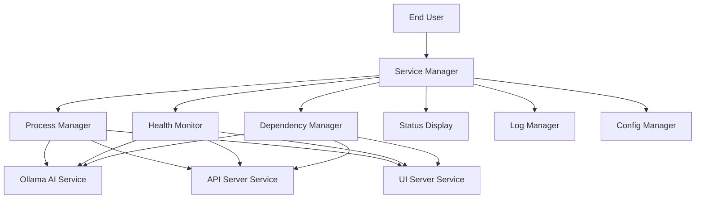
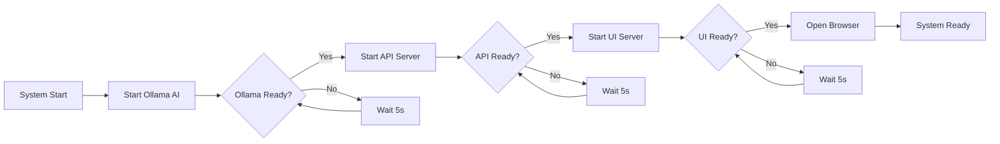

# Service Orchestration Design

## Overview

This design document outlines the architecture for a comprehensive service orchestration system for DecideAI that manages Ollama AI, API server, and UI server as a unified application with proper dependency management, health monitoring, and cross-platform support.

## Architecture

### High-Level Architecture



### Service Dependency Chain



## Components and Interfaces

### 1. Service Manager (Core Orchestrator)

**Purpose**: Central coordinator for all services

**Interface**:
```python
class ServiceManager:
    def start_all_services() -> bool
    def stop_all_services() -> bool
    def restart_service(service_name: str) -> bool
    def get_service_status() -> Dict[str, ServiceStatus]
    def is_system_ready() -> bool
```

**Responsibilities**:
- Coordinate service startup sequence
- Handle graceful shutdown
- Manage service lifecycle
- Provide unified status interface

### 2. Health Monitor

**Purpose**: Continuous monitoring of service health

**Interface**:
```python
class HealthMonitor:
    def start_monitoring() -> None
    def stop_monitoring() -> None
    def check_service_health(service_name: str) -> HealthStatus
    def register_health_callback(callback: Callable) -> None
    def get_health_report() -> HealthReport
```

**Responsibilities**:
- Periodic health checks (every 30 seconds)
- Automatic restart on failure
- Health status reporting
- Alert generation

### 3. Dependency Manager

**Purpose**: Manage service dependencies and startup order

**Interface**:
```python
class DependencyManager:
    def wait_for_dependency(service: str, dependency: str, timeout: int) -> bool
    def check_dependency_ready(service: str) -> bool
    def get_dependency_chain() -> List[str]
    def validate_dependencies() -> bool
```

**Responsibilities**:
- Enforce startup order
- Wait for dependencies
- Timeout management
- Dependency validation

### 4. Process Manager

**Purpose**: Low-level process management for each service

**Interface**:
```python
class ProcessManager:
    def start_process(service_config: ServiceConfig) -> Process
    def stop_process(process: Process) -> bool
    def is_process_running(process: Process) -> bool
    def get_process_info(process: Process) -> ProcessInfo
```

**Responsibilities**:
- Process creation and termination
- Process monitoring
- Resource management
- Cross-platform compatibility

### 5. Service Configurations

**Ollama Service Config**:
```python
@dataclass
class OllamaServiceConfig:
    command: List[str] = ["ollama", "serve"]
    port: int = 11434
    health_endpoint: str = "/api/tags"
    startup_timeout: int = 60
    required_models: List[str] = ["llama3.2:3b", "mistral:7b"]
```

**API Service Config**:
```python
@dataclass
class APIServiceConfig:
    command: List[str] = [sys.executable, "-m", "uvicorn", "ai_employee_decision_system.api.app:app"]
    host: str = "0.0.0.0"
    port: int = 8000
    health_endpoint: str = "/health"
    startup_timeout: int = 30
    dependencies: List[str] = ["ollama"]
```

**UI Service Config**:
```python
@dataclass
class UIServiceConfig:
    command: List[str] = [sys.executable, "start_ui.py"]
    port: int = 7860
    health_endpoint: str = "/"
    startup_timeout: int = 30
    dependencies: List[str] = ["api"]
```

## Data Models

### Service Status Model

```python
@dataclass
class ServiceStatus:
    name: str
    state: ServiceState  # STARTING, RUNNING, STOPPING, STOPPED, FAILED
    pid: Optional[int]
    port: Optional[int]
    health: HealthStatus
    uptime: timedelta
    last_check: datetime
    error_message: Optional[str]
```

### Health Status Model

```python
@dataclass
class HealthStatus:
    is_healthy: bool
    response_time: float
    last_check: datetime
    consecutive_failures: int
    error_details: Optional[str]
```

### System Status Model

```python
@dataclass
class SystemStatus:
    overall_health: bool
    services: Dict[str, ServiceStatus]
    startup_time: datetime
    total_uptime: timedelta
    resource_usage: ResourceUsage
```

## Error Handling

### Error Categories

1. **Startup Errors**:
   - Service binary not found
   - Port already in use
   - Dependency timeout
   - Configuration errors

2. **Runtime Errors**:
   - Service crash
   - Health check failure
   - Resource exhaustion
   - Network connectivity issues

3. **Shutdown Errors**:
   - Process won't terminate
   - Data corruption
   - Cleanup failures

### Error Recovery Strategies

```python
class ErrorRecoveryStrategy:
    def handle_startup_failure(service: str, error: Exception) -> RecoveryAction
    def handle_runtime_failure(service: str, error: Exception) -> RecoveryAction
    def handle_dependency_failure(service: str, dependency: str) -> RecoveryAction
```

**Recovery Actions**:
- `RETRY`: Attempt restart
- `WAIT_AND_RETRY`: Wait then retry
- `SKIP`: Continue without service
- `ABORT`: Stop entire system
- `USER_INTERVENTION`: Request user action

## Testing Strategy

### Unit Tests

1. **Service Manager Tests**:
   - Service startup sequence
   - Dependency management
   - Error handling
   - Status reporting

2. **Health Monitor Tests**:
   - Health check accuracy
   - Failure detection
   - Recovery mechanisms
   - Performance impact

3. **Process Manager Tests**:
   - Cross-platform compatibility
   - Process lifecycle management
   - Resource cleanup
   - Error scenarios

### Integration Tests

1. **End-to-End Service Tests**:
   - Complete startup sequence
   - Service interaction
   - Failure scenarios
   - Performance under load

2. **Cross-Platform Tests**:
   - Windows compatibility
   - macOS compatibility
   - Linux compatibility
   - Different Python versions

### Performance Tests

1. **Startup Performance**:
   - Time to full system ready
   - Resource usage during startup
   - Concurrent startup handling

2. **Runtime Performance**:
   - Health check overhead
   - Memory usage over time
   - CPU usage patterns

## Implementation Plan

### Phase 1: Core Service Management
- Implement ServiceManager class
- Basic process management
- Simple dependency handling
- Cross-platform compatibility

### Phase 2: Health Monitoring
- Implement HealthMonitor class
- Periodic health checks
- Basic failure detection
- Automatic restart capability

### Phase 3: Advanced Features
- Sophisticated dependency management
- Advanced error recovery
- Resource monitoring
- Performance optimization

### Phase 4: User Experience
- Status display interface
- Browser auto-launch
- Progress indicators
- Error messaging

### Phase 5: Production Features
- Logging integration
- Configuration management
- Scaling support
- Enterprise features

## Configuration Management

### Service Configuration File

```yaml
# decideai_services.yaml
services:
  ollama:
    command: ["ollama", "serve"]
    port: 11434
    health_endpoint: "/api/tags"
    startup_timeout: 60
    restart_policy: "always"
    
  api:
    command: ["python", "-m", "uvicorn", "ai_employee_decision_system.api.app:app"]
    host: "0.0.0.0"
    port: 8000
    health_endpoint: "/health"
    startup_timeout: 30
    dependencies: ["ollama"]
    restart_policy: "on-failure"
    
  ui:
    command: ["python", "start_ui.py"]
    port: 7860
    health_endpoint: "/"
    startup_timeout: 30
    dependencies: ["api"]
    restart_policy: "on-failure"

system:
  health_check_interval: 30
  max_restart_attempts: 3
  startup_timeout: 120
  shutdown_timeout: 30
  auto_open_browser: true
```

## Monitoring and Logging

### Log Structure

```python
@dataclass
class ServiceLogEntry:
    timestamp: datetime
    service: str
    level: LogLevel  # DEBUG, INFO, WARN, ERROR, CRITICAL
    message: str
    context: Dict[str, Any]
```

### Metrics Collection

- Service uptime
- Health check response times
- Restart frequency
- Resource usage (CPU, memory)
- Error rates

## Security Considerations

1. **Process Isolation**: Each service runs in its own process
2. **Port Security**: Validate port availability and permissions
3. **Command Injection**: Sanitize all command parameters
4. **Resource Limits**: Prevent resource exhaustion
5. **Log Security**: Sanitize sensitive information in logs

## Deployment Considerations

### Development Mode
- Verbose logging
- Quick restart on failure
- Development-friendly error messages

### Production Mode
- Optimized logging
- Robust error handling
- Performance monitoring
- Resource optimization

### Docker Integration
- Container orchestration support
- Health check integration
- Volume management
- Network configuration

This design provides a robust, production-ready service orchestration system that addresses all the requirements while maintaining simplicity for end users and flexibility for different deployment scenarios.